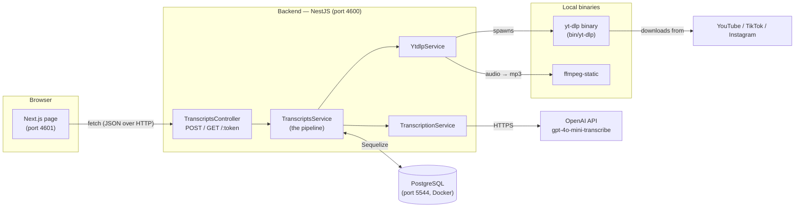
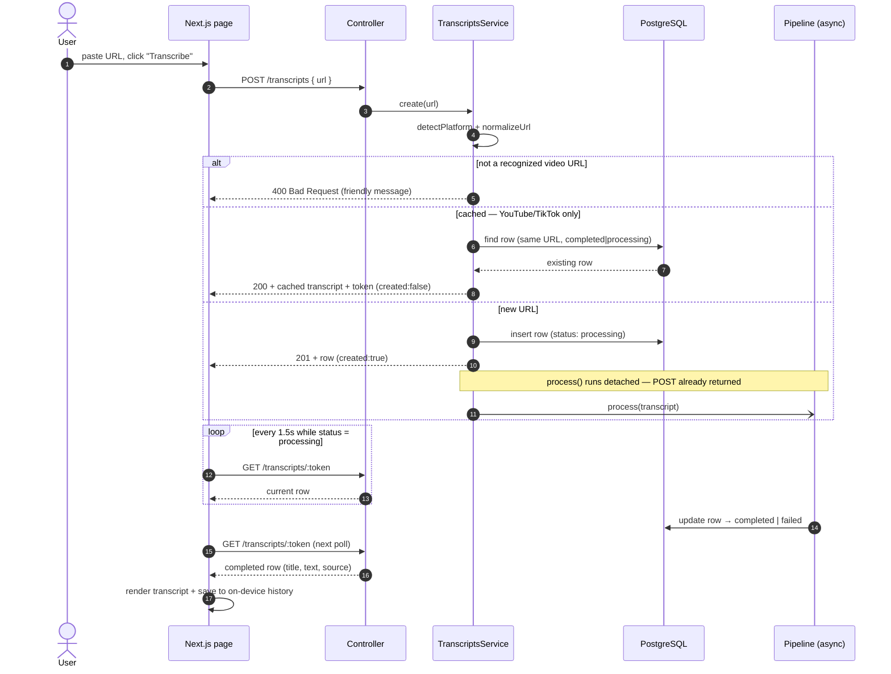
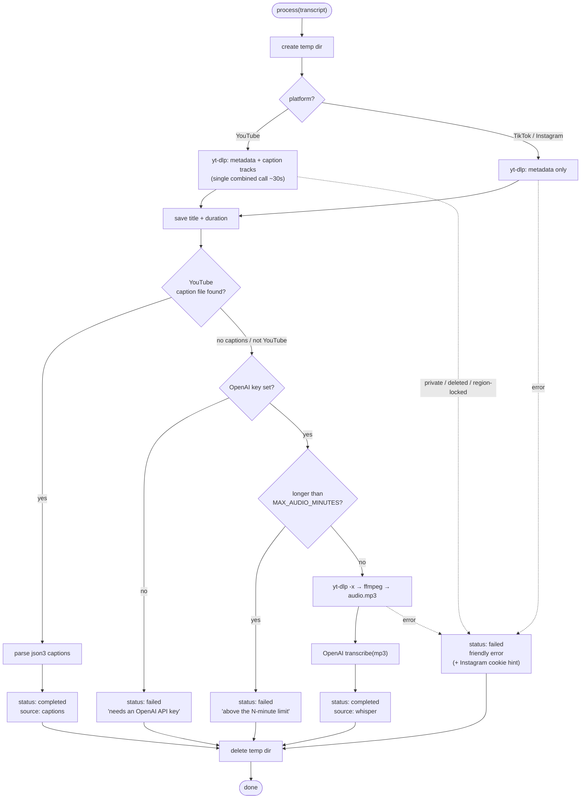
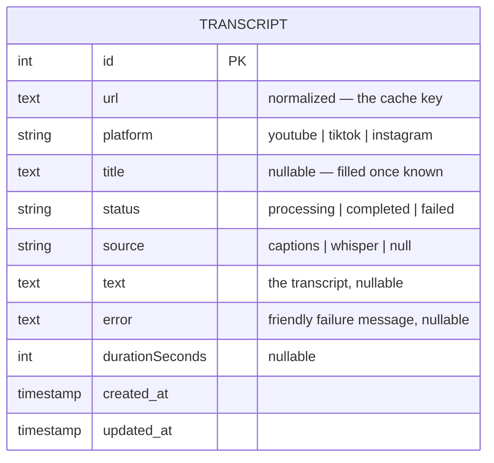
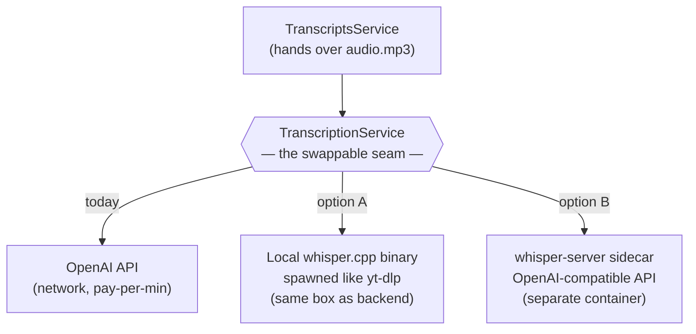

# Clipscript — Architecture & End-to-End Flow

_Paste a YouTube / TikTok / Instagram link → get the full transcript._

This document is the map of how the app works: the moving parts, what calls what,
and where the transcription engine could live if the app is ever hosted rather than
run locally. Diagrams are [Mermaid](https://mermaid.js.org) — they render on GitHub
and in most editors.

---

## 1. The parts

**One-line role of each piece**

| Part | Job |
|------|-----|
| **Next.js page** | Single screen: paste box, live status, transcript, and history kept **in the browser** (localStorage). Talks to the backend over `fetch`. |
| **TranscriptsController** | The HTTP surface — 2 routes (create, read-by-token), thin. Validates the body, sets status codes. |
| **TranscriptsService** | The brain. URL validation, dedupe/cache, and the async processing pipeline. |
| **YtdlpService** | Wraps the `yt-dlp` binary: fetch metadata, pull captions, download audio. |
| **TranscriptionService** | Wraps OpenAI speech-to-text. **This is the swappable piece** (see §5). |
| **PostgreSQL** | The public-content cache (YouTube/TikTok, keyed by URL). History is not here — it lives on each device. |

---

## 2. End-to-end flow — pasting a link

This is the "what causes what" for the main path. Note the **fire-and-forget**: the
POST returns immediately with a `processing` row, and the browser *polls* for the result.

**Why polling and not websockets?** For a single-user personal app, a 1.5s poll is
simpler than a socket layer and just as responsive. The frontend also runs a 1-second
"elapsed" clock purely to animate the status line ("Pulling captions…", "Listening to
the audio…").

---

## 3. The processing pipeline — captions first, audio as fallback

This is the decision tree inside `process()`. The key idea: **YouTube captions are free
and fast, so try them first; only download and transcribe audio when there's no caption
track** (always the case for TikTok/Instagram).

**Guarantees baked in here**

- **Every path cleans up its temp dir** (the `finally` block) — no orphaned files even on failure.
- **A stuck job can't poison the cache**: the temp dir is created *inside* the `try`, so a
  crash still flips the row to `failed` instead of leaving it `processing` forever.
- **Failures are human-readable**, not stack traces — e.g. the no-key message tells you
  exactly which env var to set, and Instagram errors add the cookie hint.
- **Every step logs** to the backend console with the transcript id, the exact `yt-dlp`
  command, timings, and word counts (added so you can watch the pipeline work).

---

## 4. Data model

One table, `transcripts`, is the public-content **cache** — keyed by URL, with no notion of
who made a transcript. (History is not stored here; it lives in each browser's localStorage.)
The public handle is a signed **token**, not the raw `id`, so rows can't be enumerated.

- **`url` is normalized before storage** (`youtu.be/x`, `/shorts/x`, and `watch?v=x&…`
  all collapse to one canonical URL), so the same video is never processed twice.
- **The cache lookup** (YouTube/TikTok only) is: newest row for this URL whose status is
  `completed` or `processing`. A `failed` row does *not* block a retry. **Instagram is
  never matched against the cache** — each request re-processes it.
- No enum constraints in the DB — status/platform/source are plain strings, enforced in
  app code (team convention carried over from Seamless).

---

## 5. Hosting the transcription engine (your "run it alongside the app" question)

Today, transcription is the **only** part that leaves your machine — it's an HTTPS call
to OpenAI. Everything else (yt-dlp, ffmpeg, Postgres, both servers) already runs locally.

The important design fact: **`TranscriptionService` is a seam.** Nothing else in the app
knows or cares *how* audio becomes text. That means the engine can be swapped — and can
live in different places — without touching the pipeline.

**Can Whisper be hosted alongside the app? Yes — three shapes:**

| Where Whisper runs | How it works | Best when |
|--------------------|--------------|-----------|
| **On your Mac (now)** | whisper.cpp binary in `bin/`, spawned like yt-dlp. Uses the M3 Pro's Metal GPU — free, fast. | Local/personal use. Zero cost, zero API key. |
| **Same server as the backend** | When deployed, the binary ships with the backend and is spawned the same way. | A hosted app **with a GPU box**. |
| **Sidecar service** | Run `whisper-server` (OpenAI-compatible) as its own container; backend points `baseURL` at it. | You want the transcriber to scale/restart independently of the API. |

**The honest catch when hosted, not local:** on your Mac, local Whisper is free because
you already own the hardware. On a *rented* server it is not — a CPU-only cloud box
transcribes slowly, and a GPU box is expensive and billed even while idle. At personal
volume the OpenAI API (a few dollars a month) is often **cheaper and simpler** than paying
for an always-on GPU. So the rule of thumb:

- **Running locally →** local Whisper wins (free, private, no key).
- **Hosted, low volume →** OpenAI API usually wins (no idle server cost).
- **Hosted, high volume or you already have a GPU →** self-hosted Whisper wins.

Because it's behind the seam, the choice becomes a single env-var/config switch — not a
rewrite. That's the payoff of keeping `TranscriptionService` as an interface.

---

## 6. Ports & processes (local dev)

| Process | Port | Started by |
|---------|------|-----------|
| Frontend (Next.js) | 4601 | `npm run dev:frontend` |
| Backend (NestJS) | 4600 | `npm run dev:backend` |
| PostgreSQL (Docker) | 5544 | `npm run db:up` |

CORS on the backend allows exactly `http://localhost:4601`. The frontend's API base is
`NEXT_PUBLIC_API_URL` (defaults to `http://localhost:4600`).
